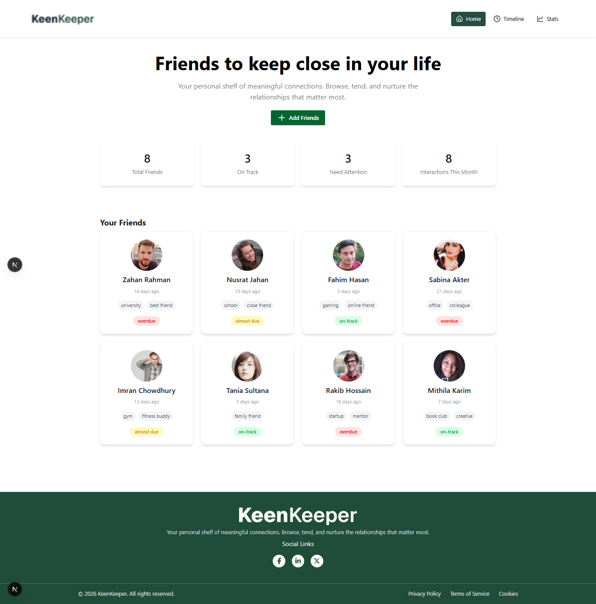
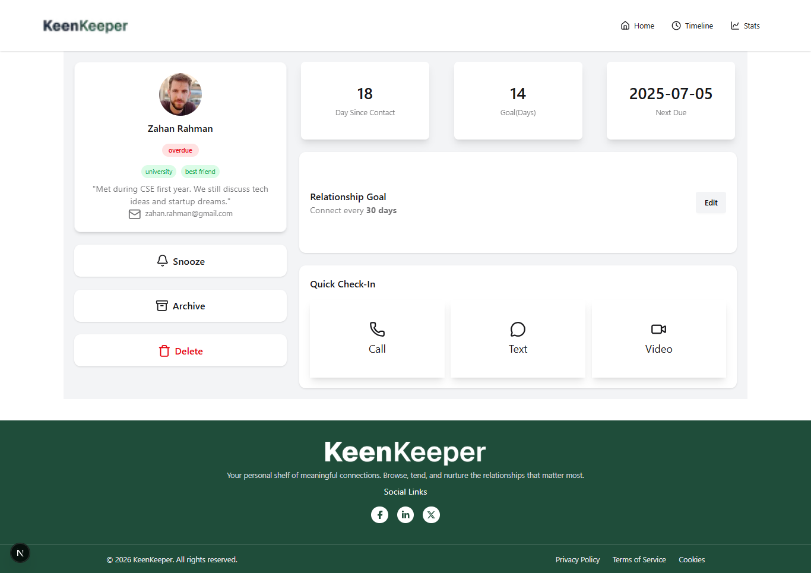
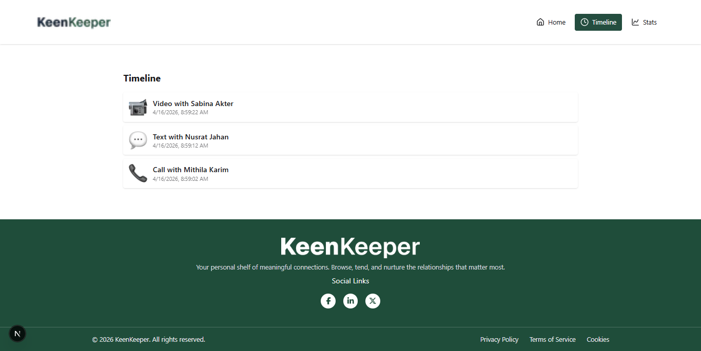
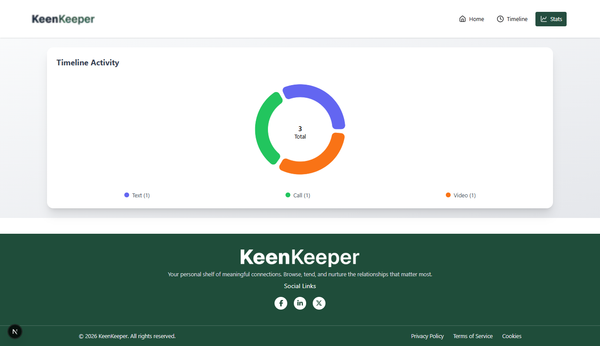

# 🧡 KeenKeeper

## 📌 Short Description
KeenKeeper is a friendship management web application that helps users track their friends, log interactions (Call, Text, Video), and maintain healthy relationships through reminders and activity tracking. It also provides visual analytics of communication history.

---

## 🛠️ Technologies Used
- Next.js (App Router)
- React.js
- Tailwind CSS
- Recharts
- Context API

---

## ✨ Key Features
1. 👥 Manage friends and view detailed profiles with status tracking  
2. ⚡ Log interactions like Call, Text, and Video with automatic timeline updates  
3. 📊 Visual analytics dashboard showing interaction breakdown using a pie chart  

---

## 📸 Screenshots

### 🏠 Home Page

### 👤 Friend Details Page

### 📜 Timeline Page

### 📊 Stats Page
